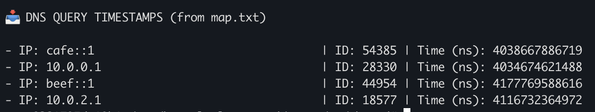
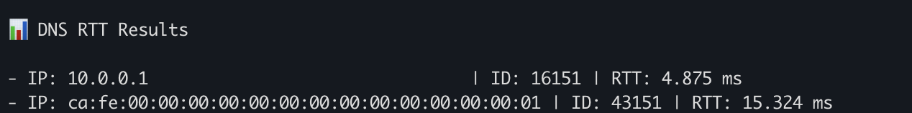
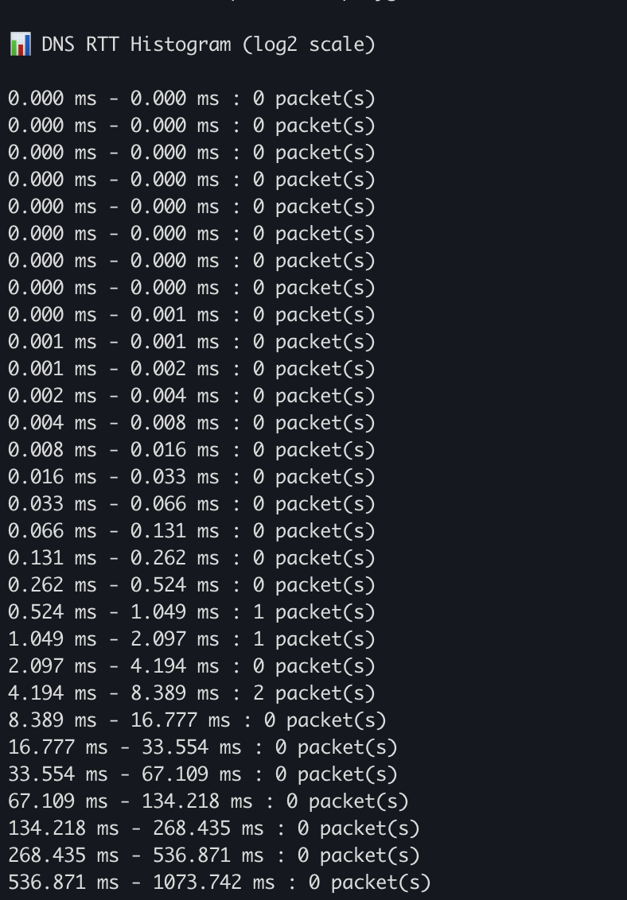

# DNS Response Latency Monitoring

A detailed report explaining the code functionality is available in the `SNProject.pdf` file.

After setting up the kernel-playground by following the instructions in the `/podman` and `/tests/vm` README files, you can proceed to test this code.

## Setup 


### Setup Container

In the `/opt/kernel-playground/src/c` directory, there are subfolders for the basic, intermediate, and advanced tasks. Copy the `netprog.h` and `netprog.bpf.c` files from the relevant subdirectory into `/opt/kernel-playground/src/c`, then run:

```sh
make
make install
```

This will copy the `.o` file related to that task into the `shared` folder inside the VM. If you want to try another task, you should re-do this using the appropriate files.

You also need to copy the contents of `/opt/kernel-playground/tests/scripts` (specifically: `xdp_icmpv6_drop.sh`, `routing.sh`, `basicTaskParse.py`, `intermediateTaskParse.py`, and `advancedTaskParse.py`) into `/opt/kernel-playground/tests/vm/shared`. You can do this with the following command:

```sh
cp /opt/kernel-playground/tests/scripts/xdp_icmpv6_drop.sh \
    /opt/kernel-playground/tests/scripts/routing.sh \
    /opt/kernel-playground/tests/scripts/basicTaskParse.py \
    /opt/kernel-playground/tests/scripts/intermediateTaskParse.py \
    /opt/kernel-playground/tests/scripts/advancedTask.py \
    /opt/kernel-playground/tests/vm/shared/
```

### Setup VM

Install the required packages:

```sh
apt install dnsutils dnsmasq bfptool
```

Before proceeding, verify that all the necessary files have been successfully copied to `/mnt/shared` inside the VM. You can check this by running:

```sh
ls /mnt/shared
```

Ensure that the expected `.o` files and scripts are present in this directory.


## Basic Task

### Inside the VM

Run the virtual environment described in `SNProject.pdf`

```sh
cd /mnt/shared
./xdp_icmpv6_drop.sh
```

From h0:
```sh
dig @10.0.2.1 google.com
dig -6 @beef::1 amazon.com
```

From h1:

```sh
dig @10.0.0.1 google.com
dig -6 @cafe::1 amazon.com
```

From r0:
```sh
bpftool map dump pinned /sys/fs/bpf/netprog/maps/dns_query_ts_map -j > map.txt
```

To exit from tmux, Ctrl+D then B. To go back to the container, run:
```sh
exit
```

### Inside the container
```sh
cd /opt/kernel-playground/tests/vm/shared
python3 basicTaskParse.py map.txt
```

### Output
You should see the 4 DNS Queries just done


## Intermediate Task
After building the `.o` file for the eBPF program related to this task and placing it in `/opt/kernel-playground/tests/vm/shared`, you can proceed to test the code for this task.

### Inside the VM

Run the virtual environment described in `SNProject.pdf`

```sh
cd /mnt/shared
./xdp_icmpv6_drop.sh
```
From h1 (because for the test we will use h1 as dns server):

```sh
ip netns exec h1 dnsmasq --no-daemon --no-resolv \
  --listen-address=10.0.2.1 \
  --listen-address=beef::1
```

From h0:
```sh
dig @10.0.2.1 google.com
dig -6 @beef::1 amazon.com
```

From r0:
```sh
bpftool map dump pinned /sys/fs/bpf/netprog/maps/dns_rtt_map -j -p > map.json
```

To exit from tmux, Ctrl+D then B. To go back to the container, run:
```sh
exit
```

### Inside the container
```sh
cd /opt/kernel-playground/tests/vm/shared
python3 intermediateTaskParse.py map.json
```

### Output
You should see the RTT of the IPv4 and IPv6 DNS requests just done



## Advanced Task
After building the `.o` file for the eBPF program related to this task and placing it in `/opt/kernel-playground/tests/vm/shared`, you can proceed to test the code for this task.

### Inside the VM

Run the virtual environment described in `SNProject.pdf`

```sh
cd /mnt/shared
./xdp_icmpv6_drop.sh
```
From h1 (because for the test we will use h1 as dns server):

```sh
ip netns exec h1 dnsmasq --no-daemon --no-resolv --listen-address=10.0.2.1 
```

From h0:
```sh
dig @10.0.2.1 google.com
dig @10.0.2.1 amazon.com
dig @10.0.2.1 openai.com
dig @10.0.2.1 facebook.com
```
From r0:
```sh
bpftool map dump pinned /sys/fs/bpf/netprog/maps/rtt_histogram -j -p > hist.json
```


To exit from tmux, Ctrl+D then B. To go back to the container, run:
```sh
exit
```

### Inside the container
```sh
cd /opt/kernel-playground/tests/vm/shared
python3 advancedTaskParse.py hist.json
```

### Output
You should see the RTT of the 4 DNS requests correctly classified into their bucket of the histogram



IPv6 works the same.